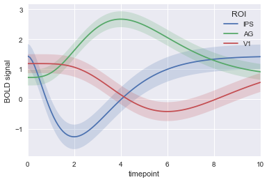

{:title "Experimental post: jupyter notebook --> cryogen post"
 :layout :post
 :date "2018-01-17"
 :executable false
 :tags  ["meta" "cryogen" "blog" "python"]}

This is an experiment to see if I can get a jupyter notebook to play nicely with cryogen.


```python
print("here's some code!")
```

    here's some code!


```python
# and here's an image, stolen from seaborn examples at https://seaborn.pydata.org/examples/timeseries_from_dataframe.html 
import warnings
warnings.simplefilter(action='ignore', category=UserWarning)
%matplotlib inline
import seaborn as sns
sns.set(style="darkgrid")

gammas = sns.load_dataset("gammas")

sns.tsplot(data=gammas, time="timepoint", unit="subject",
           condition="ROI", value="BOLD signal")
```


    <matplotlib.axes._subplots.AxesSubplot at 0x111ecae48>





